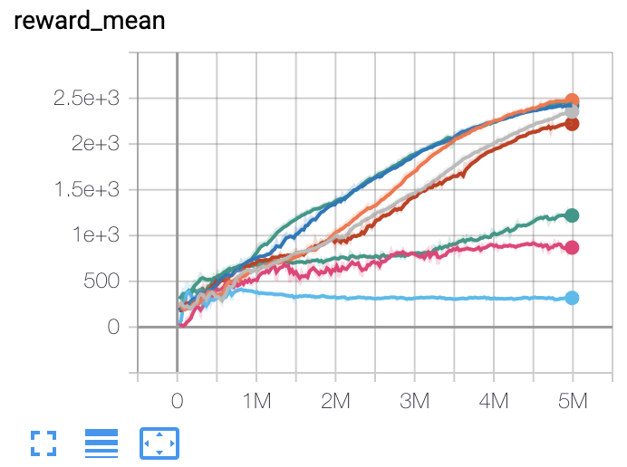
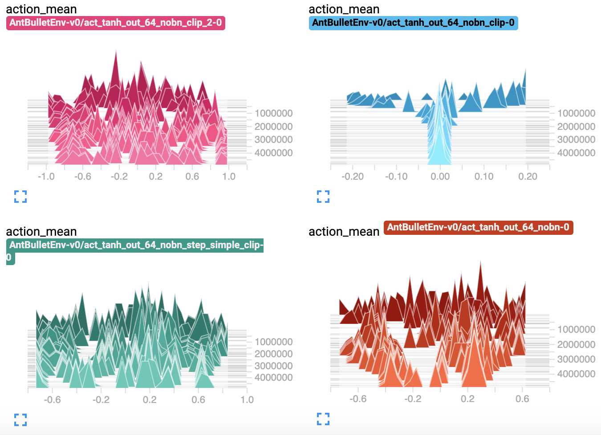
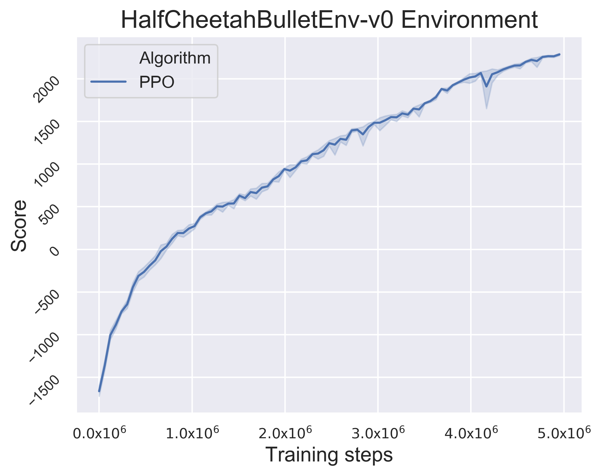
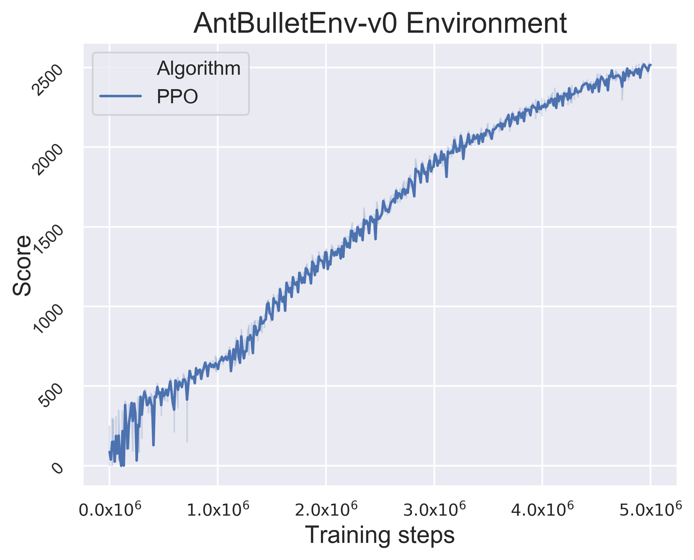

# ppo-pytorch

This is a PyTorch implementation of PPO algorithm, 
which is designed for flexible modification and high performance 
in continuous control tasks.

## Requirements 

- pytorch 1.4.0
- tensorboard
- numpy
- tqdm 
- gym
- baselines
- pybullet (optional)

## Setup

You can use the provided `requirements.txt` file to install necessary dependencies.

```bash
$ pip install -r requirements.txt
```

## Training PPO agents

For example, to train a ppo agent using 12 processes for pybullet ant locomotion task as follows:

```bash
$ python train.py --task-id=AntBulletEnv-v0 --num-processes=12 --num-env-steps=5000000
```

You can also monitor the training process and perform hyper-parameters tuning using tensorboard:

```bash
$ tensorboard --logdir=log
```

Here is what the log looks like:





## Experiment Results

It takes about half an hour for $5e6$ training steps in a six cores MacBook Pro.

HalfCheetahBulletEnv |  AntBulletEnv
:----------------------------------------------------------------------------:|:-----------------------------------------:
 | 

## Reference

John Schulman, Philipp Moritz, Sergey Levine, Michael I. Jordan, and Pieter Abbeel. High-dimensional
continuous control using generalized advantage estimation. CoRR, abs/1506.02438, 2015.

John Schulman, Filip Wolski, Prafulla Dhariwal, Alec Radford, and Oleg Klimov. Proximal policy
optimization algorithms. arXiv preprint arXiv:1707.06347, 2017.

https://github.com/ikostrikov/pytorch-a2c-ppo-acktr-gail


